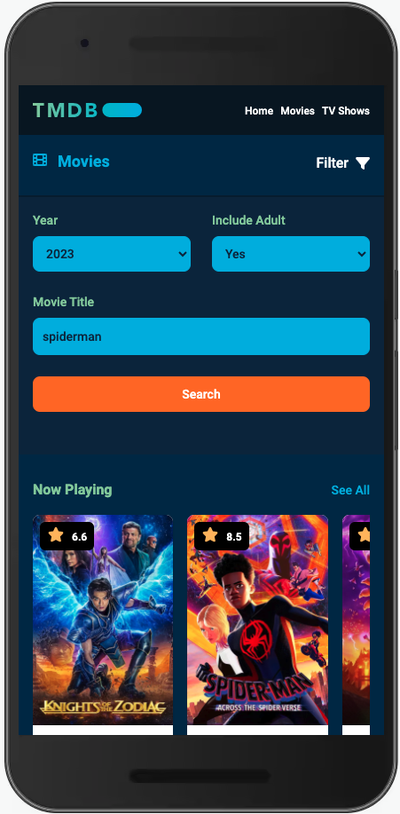
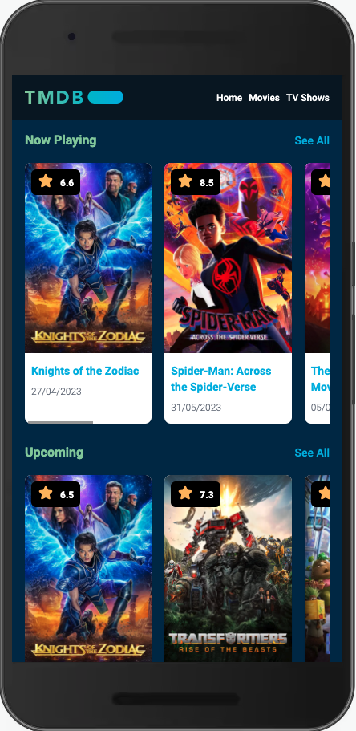
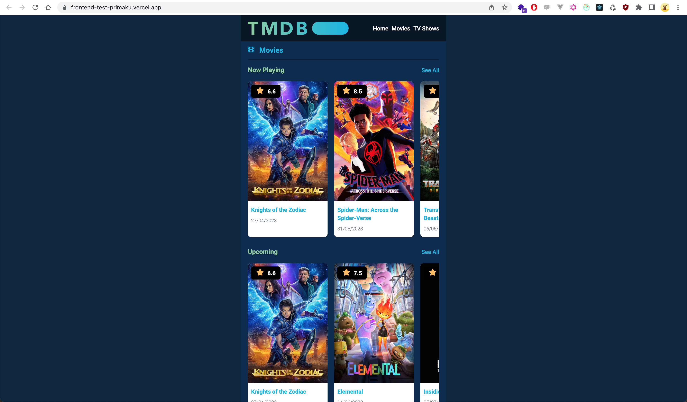
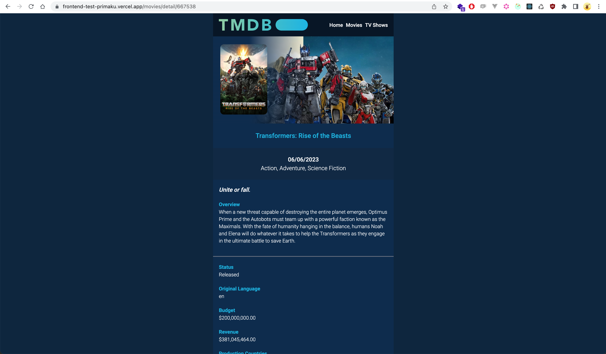

## Project Information


Hello I'm Fathan. this project bootstrapped with [`create-next-app`](https://github.com/vercel/next.js/tree/canary/packages/create-next-app).

----

## Technology Stack

```bash
- TypeScript
- React.js 18
- Next.js 13
- Redux for State Management
- TailwindCSS 3.3.2
```

## Getting Started

First, run the development server:

```bash
$ npm run dev
# or
$ yarn dev
# or
$ pnpm dev
```

For build to production run:
```bash
$ npm run build
```

For run Unit Testing:
```bash
$ npm run test:unit
```

Open [http://localhost:3000](http://localhost:3000) with your browser to see the result.

----

## Production
- Project has been deployed in Vercel. please check this link: [`https://tmdb-next-kohl.vercel.app`](https://tmdb-next-kohl.vercel.app).

----

## Screenshot projects
----

## Searching Movie Page Mobile view<br>


## Movie Page Mobile view<br>


## Home Web<br>


## Movies Detail Web<br>


<br>
<br>

## @TODO
- Unit Testing